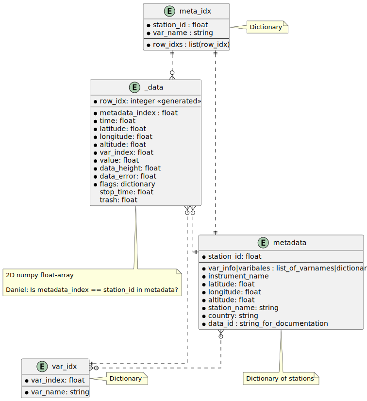

===================
UngriddedData
===================

UngriddedData is the main class for holding ungridded data -- mostly used for obervational data -- in pyaerocom.
The class can either be instanciated and filled manually (see below for structure), or be created from a dictionary of StationData objects :ref:`_stationsdata_overview`.

**Note**: There does not seem to be any function to create an UngriddedData given the attributes described below. Instead ``__init__`` creates empty versions of said attributes, and it is up to the user to access the attributes and filling them in by hand

Structure
=========

UngriddedData contains 4 main attributes:

* *_data*: an unstructured point cloud with all the data (time, position, values, etc.)
* *metadata*: metadata for each station
* *meta_idx*: mapping from station to variable and indices of rows in _data where measurements for said station and variable are found
* *var_idx*: mapping of variable names to index of variable used in *_data*

_data
-----
_data is the main data structure of UngriddedData, and in is an unstructured table (2D numpy array) where each row is a single measurement.
Each row consists of 12 columns holding all the relevant information about the measurement. The 12 columns are ordered as follows

0. metadata index **float** : index pointing to a key in the *metadata* dictionary. Each index corresponds to one station
1. time **float** : timestamp of the measurement
2. latitude **float** : latitude of the measurement device
3. longitude **float** : longitude of the measurement device
4. altitude **float** : altitude of the measurement device
5. var index **float** : index pointing to keys in the *var_idx* dictionary. Each value of the index corresponds to one variable name
6. value **float** : value of the single measurement
7. data height **float** : height of the measurement. Can be different from the altitude of the measurement device (e.g. when measuring profiles)
8. data error **float** : measurement error
9. flags **dictionary** : dictionary of flags associated with measurement
10. stop time **float** : In cases where the measurement has a stop time associated with it
11. trash **float** : column where invalid data can be moved. Used internally for example when outliers are removed

metadata
--------

This is a dictionary containing metadata for all the stations used in *_data*. The keys are unique ids for each station, with the value being another dictionary. The content of this dictionary is not well documented, but this is the necessary keys I found:

* station_id **float** : the **key** of the dictionary. Unique float/int pointing to a station.
* data_id **string** : the name/id of the dataset(e.g. EEA, EBAS, etc) used to produce the measurements
* var_info/variables **dict/list** : in it's basic form just a list of measured variables, or in the case of *var_info* a dictionary where the variables as keys and info (e.g. units) are the values. The name of the variable must be in the aerocom convention!
* instrument_name **string** (optional) : name of the instrument
* latitude **float** : latitude of the measurement device
* longitude **float** : longitude of the measurement device
* altitude **float** : altitude of the measurement device
* station_name **string** : name of the station
* country **string** (optional but recommended (bad practice, I know)) : country where the station is located

Other metadata can be added for later filtering!

More on *var_info*: This is a dictionary where the key is the name of the value is another dictionary containing atleast the following data:
* unit **string** : the unit of the variable

meta_idx
--------
A dictionary mapping a station id (float) and variable name  (string) (i.e. ``self.meta_idx[station_id][var_name]``) to a list of indices for rows the *_data* array where said measurements are found.

meta_idx is mostly used to make conversion from station data faster.

var_idx
-------
In *_data* the variable is stored as a **float** index instead of a **string**. This dictionary maps the variable name (string) to this index (float)
