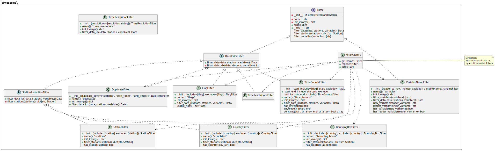

API
========

Documentation of the core API of pyaro.

Pyaro
^^^^^^^^^^^^

.. autofunction:: pyaro.list_timeseries_engines
.. autofunction:: pyaro.open_timeseries
.. autofunction:: pyaro.timeseries_data_to_pd

pyaro.timeseries - User API
^^^^^^^^^^^^

.. autoclass:: pyaro.timeseries.Reader
   :members:
   :undoc-members:
.. autoclass:: pyaro.timeseries.Data
   :members:
   :undoc-members:
.. autoclass:: pyaro.timeseries.Station
   :members:
   :undoc-members:
.. autoclass:: pyaro.timeseries.Flag
   :members:
   :undoc-members:

pyaro.timeseries.filters - Filters
^^^^^^^^^^^^

.. automodule:: pyaro.timeseries.Filter
   :members: FilterFactory, FilterCollections, Filter, StationFilter, CountryFilter, BoundingBoxFilter, FlagFilter, TimeBoundsFilter, TimeResolutionFilter, DuplicateFilter
   :undoc-members:
   :imported-members:

pyaro.timeseries - Dev API
^^^^^^^^^^^

.. automodule:: pyaro.timeseries
   :members: Engine, NpStructuredData
   :undoc-members:
   :imported-members:

.. automodule:: pyaro.timeseries.AutoFilterReaderEngine
   :members: AutoFilterReader, AutoFilterEngine
   :undoc-members:
   :imported-members:
   :private-members:

.. automodule:: pyaro.timeseries.Filter
   :members: DataIndexFilter
   :undoc-members:
   :imported-members:

csvreader for timeseries
^^^^^^^^^^^^

A simple implementation of a timeseries reader based on csv-files, usually accessed
as ``pyaro.open-timeseries('csv_timeseries', ...)``

.. automodule:: pyaro.csvreader
   :members: CSVTimeseriesReader
   :undoc-members:
   :imported-members:
